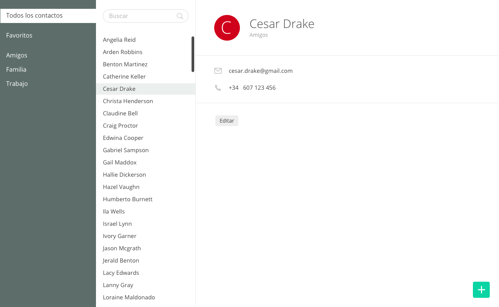

# Libreta de contactos

## Características generales de la aplicación:
- Diseño fluido (full width).
- En la columna izquierda se encuentran los grupos al que pueden pertenecer los contactos: cada contacto puede pertenecer a un solo grupo.
- El buscador no tendrá ninguna funcionalidad JavaScript.
- La lista de los contactos ha de ser en orden alfabético.
- Tras confirmar la creación de un nuevo contacto la aplicación mostrará el detalle del mismo.
- Detalle del contacto: cada nombre es acompañado por un circulo y en su interior la primera letra del nombre. El circulo tiene un color de fondo aleatorio entre los siguientes:
  - `#d0021b`
  - `#02b4d0`
  - `#5502d0`
  - `#024bd0`
  - `#c702d0`
  - `#02d0ab`
  - `#47d002`
  - `#c9d002`
  - `#d09202`

## Requisitos HTML:

- HTML5.
- El HTML ha de ser semántico.
- Los iconos han de ser en formato SVG.
- Uso de la metodología BEM para crear los bloques (componentes).
- La columna del formulario se muestra con un efecto de deslizamiento + desvanecimiento. La misma se ocultará con una animación inversa.

## Requisitos CSS:

- Uso del preprocesador SCSS.
- CSS Grid para la rejilla principal.
- Botones: el estado `:hover` se corresponde a su color de fondo un 5% más oscuro.
- Nombre del grupo: el estado `:hover` aplica un color de fondo.
- Nombre de contacto: el estado `:hover` convierte el nombre en negrita y además muestra un botón para eliminar el mismo.
- Todos los estados `:hover` tendrán un cambio de estilo gradual. Pueden aplicar el mismo tiempo de duración y la misma curva de velocidad.
  
## Requisitos Javascript:

- Solo se puede utilizar Javascript o JQuery.
- Se puede utilizar cualquier recurso propio o externo a excepción de frameworks como Angular.
- En el fichero `main.js` esta definida una variable `contacts` que contiene el array de contactos que se tiene que pintar en la web. En esta variable es donde se deberán añadir, borrar o editar los contactos.
 

#
